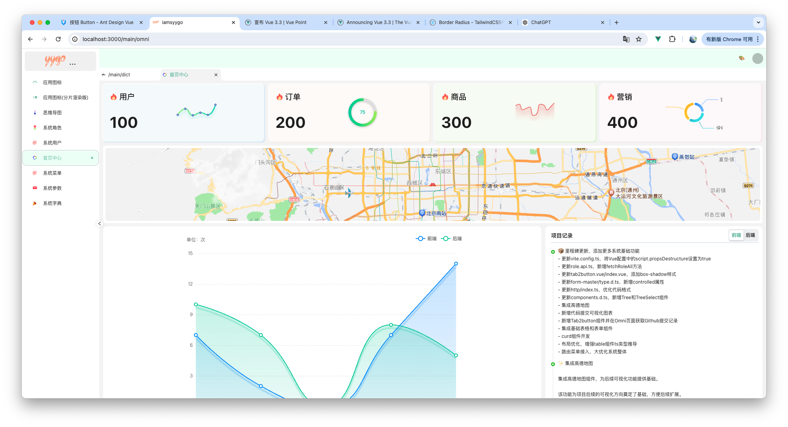
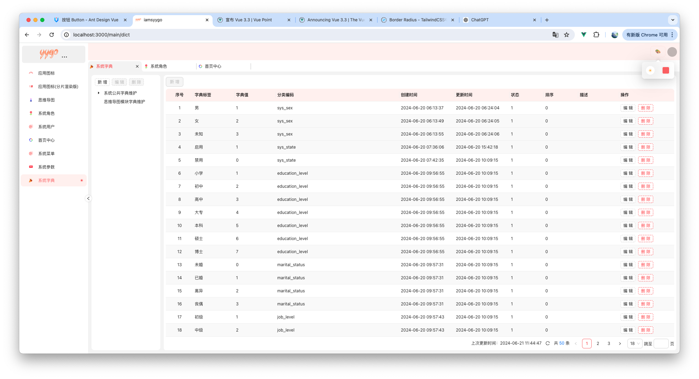

# web-vue-chili(🌶️)

### 📝 Description

使用 vue3 + vite5 + typescript + antdv + unocss + pinia

### 📦 Install

```bash
pnpm install
```

### 🚀 Run

```bash
pnpm run dev
```

### 👀 Preview




### 🙋🏻‍♂️ Problem

- `<router-view>` can no longer be used directly inside `<transition>` or `<keep-alive>`.
  `<router-view>` 不能再直接在 `<transition>` 或 `<keep-alive>` 内部使用。

- Component inside `<Transition>` renders non-element root node that cannot be animated.
  `<Transition>` 中的组件呈现不能动画化的非元素根节点。针对这个问题解决方法：禁止在组件中使用多根节点。

- keep-alive 子节点不是一个组件。
  不是一个组件 keep-alive 缓存功能将失效。
